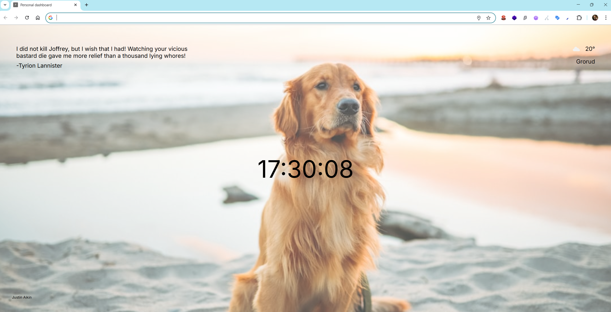

# 🐾 Personal Dashboard Extension

A simple Chrome new tab dashboard that shows you a **random dog background**, a **Game of Thrones quote**, the **current time**, and your **local weather**.  
The content refreshes every time you open a new tab.  

---

## ✨ Features
- 🖼️ **Dynamic background**  
  A random dog photo from [Unsplash](https://unsplash.com) with the photographer’s name shown.  

- 📖 **Random quote**  
  Pulls a Game of Thrones quote using [Game of Thrones Quotes API](https://api.gameofthronesquotes.xyz/).  

- ⏰ **Live clock**  
  Shows the current time, updating every second.  

- 🌤️ **Local weather**  
  Uses [OpenWeatherMap](https://openweathermap.org/) with geolocation to display the temperature, city, and weather icon.  

- ⚡ **Fallbacks**  
  If any API fails, a default image, quote, or error message is shown.

---

## 🛠️ Technologies
- HTML5  
- CSS3  
- JavaScript (ES6+ with `async/await`)  
- Public APIs:  
  - Unsplash (random photos)  
  - Game of Thrones Quotes API  
  - OpenWeatherMap (weather data)  

---

## 📦 Setup
1. Clone or download the repository.  
2. Open the folder in your code editor.  
3. Replace the OpenWeatherMap API key with your own inside `script.js`:  
   ```js
   const API_KEY = "your_api_key_here";
You can register for free at OpenWeatherMap

4. Load the extension in Chrome:
    - Go to chrome://extensions/
    - Enable Developer mode
    - Click Load unpacked
    - Select the project folder

5. Open a new tab 🎉

## 📸 Screenshot
